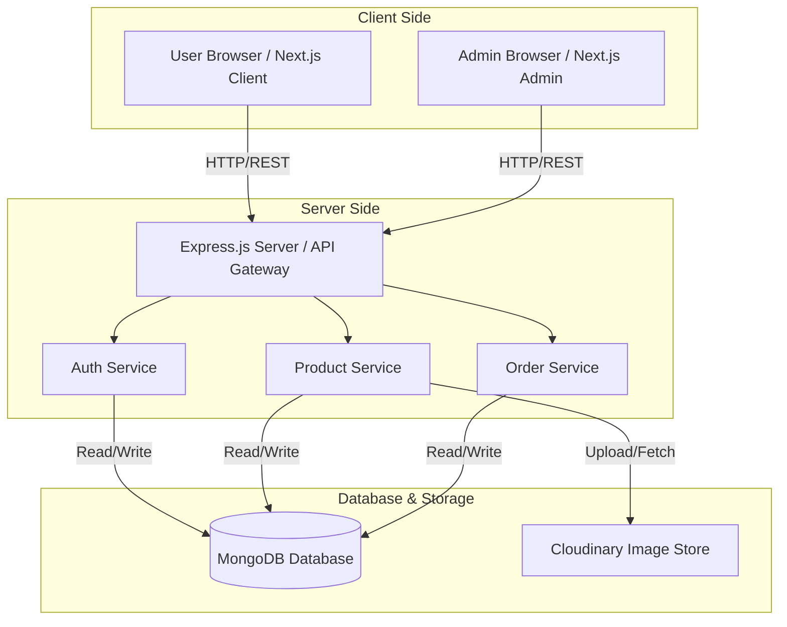
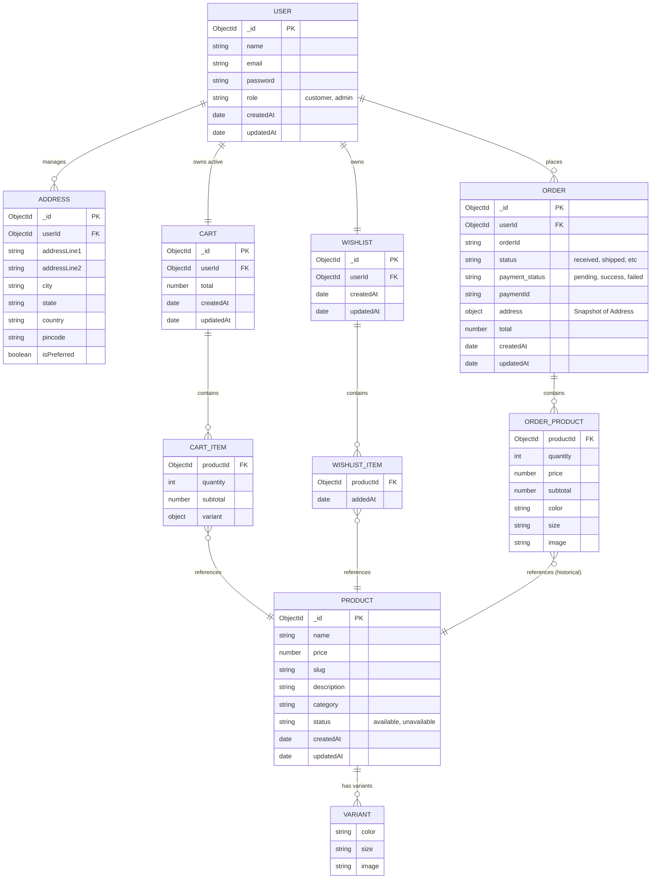
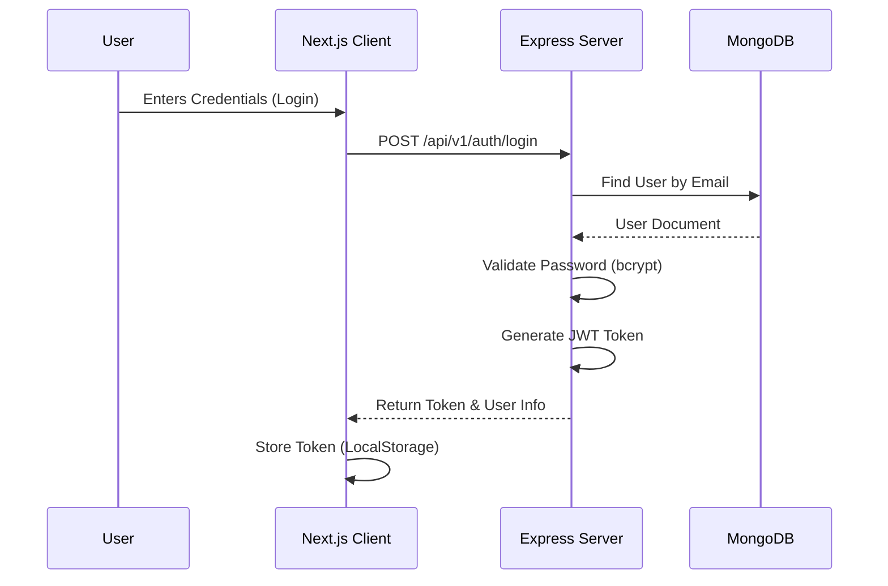
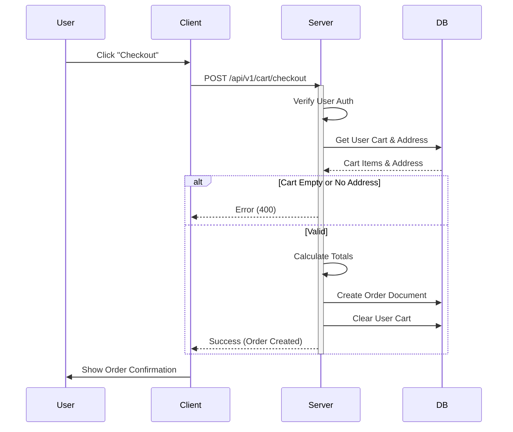

# Merchly


[](https://opensource.org/licenses/MIT)
[](https://github.com/Ujjwalprajapati16/Merchly/actions)
[](https://www.typescriptlang.org/)
[](https://nextjs.org/)
[](https://tailwindcss.com/)

**Merchly** is a modern, dynamic, and scalable e-commerce platform designed to provide a seamless shopping experience for high-quality merchandise. Built with the latest web technologies, Merchly offers a robust solution for store owners and a delightful interface for customers.

---

## 🚀 Key Features

*   **🎨 Modern Storefront**: A visually stunning and responsive UI built with **Next.js 16** and **Tailwind CSS v4**.
*   **🛒 Advanced Cart & Checkout**: Seamless shopping experience with dynamic cart management and secure checkout flows.
*   **👤 User Accounts**: Secure authentication and profile management (Order history, Wishlist, Address book).
*   **🔍 Smart Search & Filtering**: Find products instantly with advanced filtering and search capabilities.
*   **📦 Admin Dashboard**: Comprehensive tools for managing products, inventory, orders, and customers.
*   **⚡ High Performance**: Optimized for speed with server-side rendering (SSR) and static site generation (SSG).
*   **🔒 Secure**: Built with security best practices, including JWT authentication and secure payment integration.

---

## 🛠️ Tech Stack

Merchly is built using a modern full-stack architecture:

### **Frontend (Web)**
*   **Framework**: [Next.js 16](https://nextjs.org/) (App Router)
*   **Language**: [TypeScript](https://www.typescriptlang.org/)
*   **Styling**: [Tailwind CSS v4](https://tailwindcss.com/), [Shadcn/UI](https://ui.shadcn.com/)
*   **State Management**: [React Query](https://tanstack.com/query/latest)
*   **Forms**: [React Hook Form](https://react-hook-form.com/) + [Zod](https://zod.dev/)
*   **Animations**: [Framer Motion](https://www.framer.com/motion/)
*   **Icons**: [Lucide React](https://lucide.dev/), [React Icons](https://react-icons.github.io/react-icons/)

### **Backend (Server)**
*   **Runtime**: [Node.js](https://nodejs.org/)
*   **Framework**: [Express.js 5](https://expressjs.com/)
*   **Language**: [TypeScript](https://www.typescriptlang.org/)
*   **Database**: [MongoDB](https://www.mongodb.com/) with [Mongoose](https://mongoosejs.com/)
*   **Authentication**: JWT (JSON Web Tokens)
*   **File Storage**: [Cloudinary](https://cloudinary.com/)

### **DevOps & Tools**
*   **Monorepo Management**: NPM Workspaces
*   **Linting & Formatting**: ESLint, Prettier
*   **Version Control**: Git & GitHub

---

## 📂 Project Structure

Merchly follows a monorepo structure:

```plaintext
Merchly/
├── web/                 # Next.js Frontend Application
│   ├── src/
│   │   ├── app/         # App Router pages and layouts
│   │   ├── components/  # Reusable UI components
│   │   ├── lib/         # Utilities and helpers
│   │   └── hooks/       # Custom React hooks
│   └── public/          # Static assets
│
├── server/              # Express Backend Application
│   ├── src/
│   │   ├── controllers/ # Request handlers
│   │   ├── models/      # Mongoose schemas
│   │   ├── routes/      # API route definitions
│   │   └── middlewares/ # Custom middlewares
│   └── dist/            # Compiled JavaScript
│
└── package.json         # Root package file
```

---

## 🏗️ System Architecture

High-level overview of how the Client, Server, and Database interact.



---

## 🗄️ Database Schema (ERD)

Visual representation of the MongoDB data models and their relationships.


---

## 🔄 Application Workflows

### Authentication Flow

How users register and log in to the system securely.



### Checkout Process

The sequence of events from cart review to order placement.


---

## 🏁 Getting Started

Follow these steps to set up the project locally.

### Prerequisites

Ensure you have the following installed:
*   **Node.js** (v20 or higher recommended)
*   **npm** or **yarn**
*   **MongoDB** (Local or Atlas URI)
*   **Cloudinary Account** (for image upload)

### Installation

1.  **Clone the repository**
    ```bash
    git clone https://github.com/Ujjwalprajapati16/Merchly.git
    cd Merchly
    ```

2.  **Install dependencies**
    ```bash
    npm install
    ```
    *This will install dependencies for both the root, `web`, and `server` workspaces.*

### Environment Setup

Create `.env` files in both `web` and `server` directories based on the provided examples.

**`server/.env`**
```env
PORT=5000
MONGO_URI=your_mongodb_connection_string
JWT_SECRET=your_jwt_secret
CLOUDINARY_CLOUD_NAME=your_cloud_name
CLOUDINARY_API_KEY=your_api_key
CLOUDINARY_API_SECRET=your_api_secret
```

**`web/.env.local`**
```env
NEXT_PUBLIC_API_URL=http://localhost:5000/api
```

### Running Locally

You can run both the frontend and backend concurrently from the root directory:

```bash
npm run start
```

Or run them individually:

*   **Backend**: `npm run start:server` (Runs on port 5000)
*   **Frontend**: `npm run start:web` (Runs on port 3000)

Access the application at `http://localhost:3000`.

---

## 🤝 Contributing

Contributions are always welcome! If you'd like to improve Merchly, please follow these steps:

1.  **Fork the Project**
2.  **Create your Feature Branch** (`git checkout -b feature/AmazingFeature`)
3.  **Commit your Changes** (`git commit -m 'Add some AmazingFeature'`)
4.  **Push to the Branch** (`git push origin feature/AmazingFeature`)
5.  **Open a Pull Request**

---

## 📄 License

Distributed under the MIT License. See `LICENSE` for more information.

---

## 📞 Contact

**Ujjwal Prajapati** - [GitHub Profile](https://github.com/Ujjwalprajapati16)

Project Link: [https://github.com/Ujjwalprajapati16/Merchly](https://github.com/Ujjwalprajapati16/Merchly)
